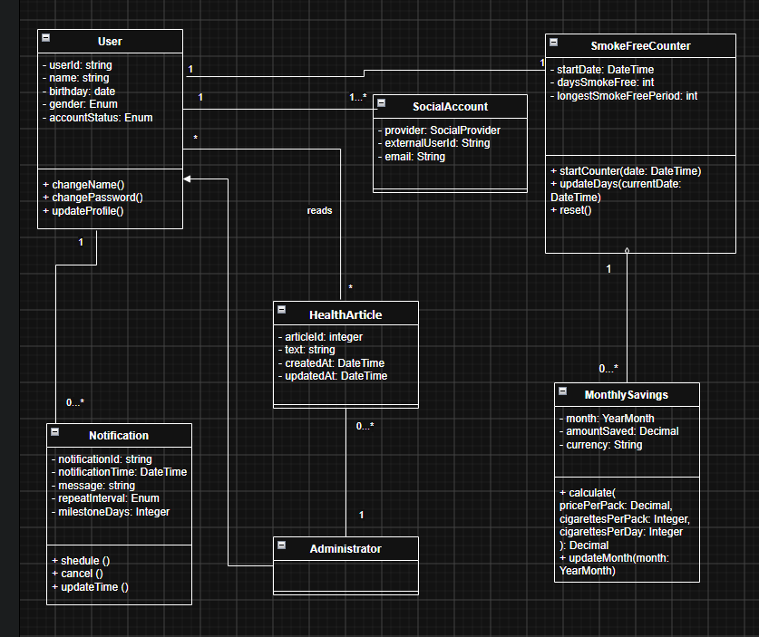

# Quit Smoking Application – Domain Class Diagram

> **Note**
>
> This UML Class Diagram was created as a portfolio project to demonstrate domain modeling and object-oriented analysis skills.

---

## Overview

This UML Domain Class Diagram represents the core business entities of the **Quit Smoking Application** and their relationships. The model focuses on the application's domain structure rather than implementation details.

---

## Project Context

The application is designed to support users in quitting smoking by providing features for tracking smoke-free days, calculating monthly savings, receiving motivational notifications, and reading educational articles.

The system also supports authentication through social network accounts and content management performed by administrators.

---

## Main Domain Entities

### User

Represents the application user and stores personal information and profile settings.

Responsibilities:

- Manage user profile
- Change personal information
- Update account settings

---

### SocialAccount

Represents an external authentication account linked to a user.

Stores:

- Authentication provider
- External user identifier
- Email address

---

### SmokeFreeCounter

Tracks the user's smoke-free progress.

Responsibilities:

- Start smoke-free counter
- Update smoke-free days
- Reset progress

---

### MonthlySavings

Represents the user's estimated monthly savings after quitting smoking.

Responsibilities:

- Calculate monthly savings
- Update monthly statistics

---

### Notification

Represents motivational notifications sent to users when predefined milestones are reached.

Stores:

- Notification message
- Notification time
- Repeat interval
- Smoke-free milestone

---

### HealthArticle

Represents educational content about smoking cessation.

Stores:

- Article text
- Creation date

---

### Administrator

Represents a system administrator responsible for managing educational content.

Responsibilities:

- Create articles
- Edit articles
- Publish articles
- Delete articles

---

## Relationships

The domain model includes the following relationships:

- A **User** owns one **SmokeFreeCounter**.
- A **User** may be linked to one or more **Social Accounts**.
- A **User** may receive multiple **Notifications**.
- A **User** may read multiple **Health Articles**.
- An **Administrator** manages multiple **Health Articles**.
- A **SmokeFreeCounter** is associated with multiple **Monthly Savings** records.

---

## UML Concepts Demonstrated

- Classes
- Attributes
- Operations
- Associations
- Multiplicity
- Generalization (Inheritance)
- Aggregation / Composition
- Domain Modeling

---

## Skills Demonstrated

- Domain Modeling
- UML Class Diagram Design
- Object-Oriented Analysis
- Business Entity Identification
- Relationship Modeling
- Multiplicity Definition
- Object Responsibility Design
- Conceptual Data Modeling

---

## Diagram Preview

