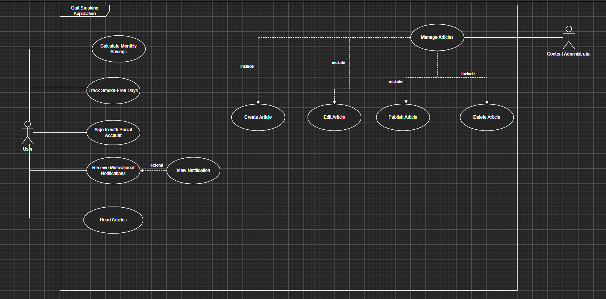

# Quit Smoking Application – Use Case Diagram

> **Note**
>
> This Use Case diagram was created as a portfolio project to demonstrate requirements analysis and UML modeling skills.

---

## Overview

This UML Use Case diagram illustrates the primary interactions between users and the **Quit Smoking Application**. It focuses on the application's core functionality, including user authentication, smoking cessation tracking, motivational support, and content management.

---

## Project Context

The application is designed to help users quit smoking by providing tools to track their progress, calculate savings, receive motivational notifications, and access educational content about smoking cessation.

The application also includes administrative functionality for managing educational articles.

---

## Actors

### User

The primary actor who interacts with the application to:

- Log in
- Track smoke-free days
- Calculate savings
- Receive motivational notifications
- View notifications
- View statistics
- Read educational articles

### Content Administrator

Responsible for managing educational content by:

- Creating articles
- Editing articles
- Publishing articles
- Deleting articles

---

## Main Functional Areas

### User Features

- User authentication
- Smoking progress tracking
- Savings calculation
- Motivational notifications
- Progress statistics
- Reading educational articles

### Administration Features

- Content management
- Article publishing
- Article editing
- Article deletion

---

## UML Relationships Used

### <<include>>

The **Manage Articles** use case includes the following mandatory sub-functions:

- Create Article
- Edit Article
- Publish Article
- Delete Article

### <<extend>>

The **View Notification** use case extends **Receive Motivational Notifications**, allowing users to open and read received notifications.

---

## Skills Demonstrated

- UML Use Case Modeling
- Functional Requirements Analysis
- Actor Identification
- Use Case Identification
- Include and Extend Relationships
- Business Function Modeling
- System Behavior Analysis

---

## Diagram Preview

